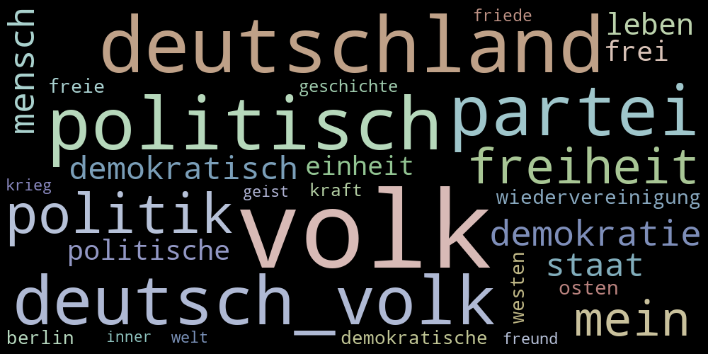

# Topic Modelling on Bundestag Speeches

Data science and natural language processing based on speeches given in Bundestag (german parliament)

## Presentation

See [raphaelw.github.io/nlp-bundestag](https://raphaelw.github.io/nlp-bundestag/)

Or run with `jupyter nbconvert presentation.ipynb --to slides --post serve`

## Resulting Topics

For all 50 topics see [topics.md](topics.md)

**Topic 8: German reunification (Deutsche Wiedervereinigung)**

## Dataset and Reproducibility

### Dataset

> Richter, F.; Koch, P.; Franke, O.; Kraus, J.; Kuruc, F.; Thiem, A.; Högerl, J.; Heine, S.; Schöps, K. (2020). Open Discourse. https://doi.org/10.7910/DVN/FIKIBO. Harvard Dataverse. V3.

### Reproducibility

- Download the dataset as feather format into `data/opendiscourse/feather/`
- Run `topic_modelling.ipynb`
- Run `topic_modelling_part_2.ipynb`
